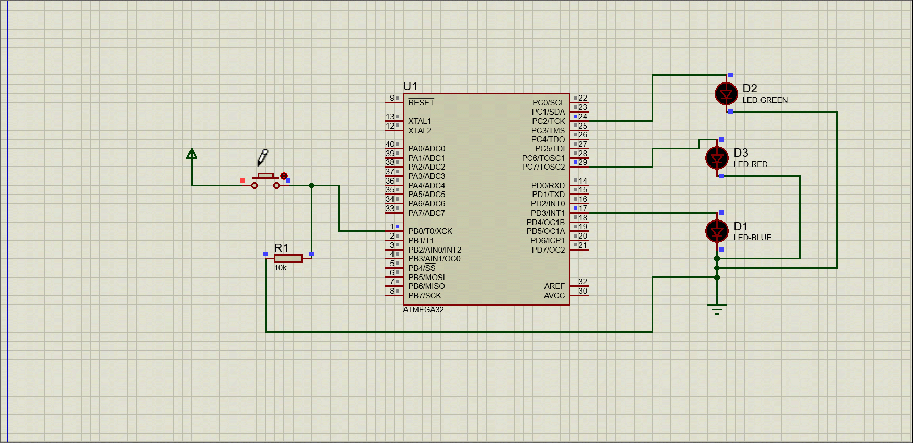

# LED Toggling System with Push Button

## Overview

This project demonstrates a simple LED toggling system using three LEDs (LED1, LED2, and LED3) and a push button on an ATmega32 AVR microcontroller. The LEDs are connected to specific pins on ports C and D, and the push button is connected to a pin on port B.

## Components Used

- ATmega32 AVR Microcontroller
- LEDs:
  - LED1: Connected to Port C, Pin 7
  - LED2: Connected to Port C, Pin 2
  - LED3: Connected to Port D, Pin 3
- Push Button: Connected to Port B, Pin 0

## Project Structure

- `main.c`: Contains the main code for the LED toggling system.
- `delay.h`: Utilizes the delay library for timing.
- `images/`: Directory to store images related to the project.

## How to Use

1. **Connections:**
   - Connect LED1 to Port C, Pin 7.
   - Connect LED2 to Port C, Pin 2.
   - Connect LED3 to Port D, Pin 3.
   - Connect the push button to Port B, Pin 0.

2. **Build and Flash:**
   - Compile the code and flash it onto your ATmega32 AVR microcontroller using your preferred development environment.

3. **Execution:**
   - After flashing the code, the LEDs will toggle their states each time the push button on Pin 0 of Port B is pressed.

## Example Image

